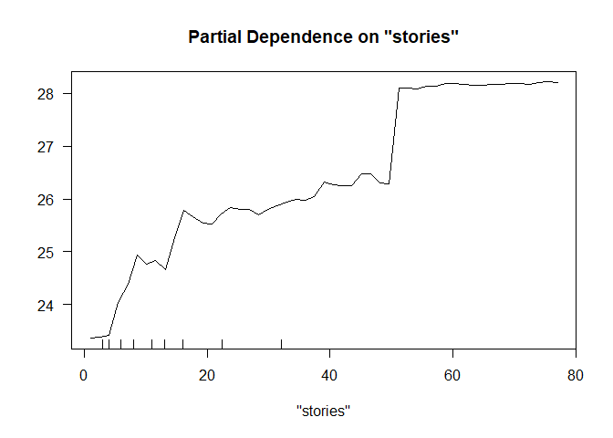
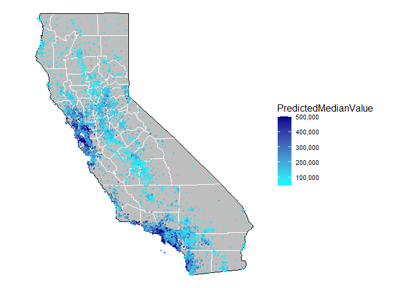
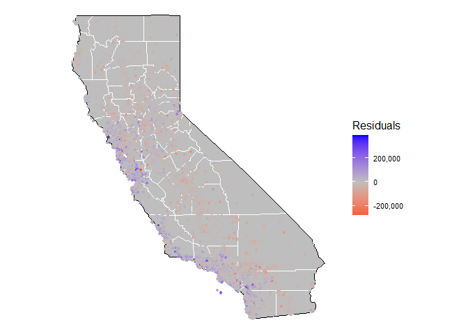

ECO 395 Homework 3: Taylor Neal
================

## 1) What Causes What?

##### Why can’t I just get data from a few different cities and run the regression of “Crime” on “Police” to understand how more cops in the streets affect crime? (“Crime” refers to some measure of crime rate and “Police” measures the number of cops in a city.)

The approached suggested above would not account for the underlying
levels of crime associated with different cities. Cities with higher
rates of crime (due to demographics, regional characteristics, etc.)
could reasonably be expected to hire larger police forces in attempt to
address crime issues. Thus, the suggested simple regression would (by
not accounting for differences in underlying crime levels) not tell us
anything about the causal impact of police on crime rates.

##### How were the researchers from UPenn able to isolate this effect? Briefly describe their approach and discuss their result in the “Table 2”, from the researchers’ paper.

The researchers from UPenn were able to isolate the impact of police on
crime by observing different levels of policing activity in the same
city (Washington, D.C.). This increased police activity (associated with
a higher terrorism alert level) was unrelated to crime levels in the
city and so these high-alert days could be compared to non-alert days to
tease out the causal impact of policing activity on crime levels. In
Table 2, they found that the regression coefficient on the high-alert
indicator variable was negative (and statistically significant at a 5%
level) which indicates that the higher level of policing activity for
high-alert days did reduce total daily crimes.

##### Why did they have to control for Metro ridership? What was that trying to capture?

Controlling for Metro ridership served as a way of ensuring that the
high-alert days were not generally lowering activity levels in the city
(and thereby causing crime rates to fall). In this way, they were able
to control for the impact of high-alert days dissuading residents and
tourists from moving about the city as usual. So, controlling for Metro
ridership allowed the researchers to more accurately capture the causal
impact of policing activity itself on crime levels.

##### Below I am showing you “Table 4” from the researchers’ paper. Just focus on the first column of the table. Can you describe the model being estimated here? What is the conclusion?

In Table 4, the researchers are continuing to model total daily number
of crimes in Washington, D.C.; however, they are separating those crimes
reported in district 1 (the National Mall - area near many of the most
important federal government buildings) and those reported in the rest
of the city. The high-alert days increase police activity generally
throughout the city, but with a greater focus/increase in the National
Mall district. Thus, the finding that crime decreases are greatest in
magnitude in district 1 (coefficient of -2.621) on high-alert days (and
statistically significant at a 1% level) provides additional support to
the conclusion that higher levels of policing activity cause crime rates
to fall. For crimes reported in the rest of the city, the regression
still finds that high-alert days decrease crimes reported, but at a much
lower magnitude (coefficient of -0.571) that is not statistically
significant at a 5% level.

## 2) Tree Modeling: Dengue Cases

Here we seek to build tree models utilizing three different
methodologies (CART, random forests and gradient-boosted trees) in order
to predict weekly dengue cases in San Juan, Puerto Rico and Iquitos,
Peru based on the provided data set. Prior to any model building, the
data was split in order to randomly reserve 20% of the observations for
testing and comparing the performance of the three models. For each of
the three methodologies, we model weekly dengue cases based on city (San
Juan or Iquitos), season (spring, summer, fall, or winter), specific
humidity, average diurnal temperature range, precipitation amount and
maximum air temperature.

Utilizing the CART methodology we greedily and recursively grow our tree
to make deviance as small as possible (for this we used a complexity
parameter of 0.0001 and minimum split of 5 observations). The resulting
candidate trees were pruned back using cross validation taking the
simplest tree within 1 standard error of the minimum cross-validated
error. This tree (above) turns out to be very simple but it does just as
well as the deeper trees at modeling our training set.

In the case of gradient-boosted trees, we assumed a Gaussian
distribution. Additional parameters included an interaction depth of 4,
500 trees, and a shrinkage factor of 0.03. This resulted in an
improvement of RMSE (43.79) of the gradient-boosted tree model when
compared to the final pruned CART tree (with RMSE of 44.12). However,
the “out-of-the-box” random forest (with 500 trees and the square root
of the number of variables used as the number of randomly sampled
variables) had the lowest RMSE (43.66) when tested against the 20% of
our observations which were withheld for model building purposes. The
plot above shows the random forest’s partial dependence plot for
specific humidity.

The partial dependence plot for precipitation amount (above) has
somewhat strange behavior for very low and very high amounts but this is
likely due to the limited number of data points at those extremes.
Overall, we see that precipitation amount appears to increase the
expected number of dengue cases (likely because the standing water
provides ample breeding grounds for mosquito). But at very high levels
of precipitation, we might expect the number of dengue cases to fall
because more people are inside avoiding the rain.

The partial dependence plot for maximum air temperature (above) has odd
behavior at very low temperatures (likely due to few observations), but
if we ignore the area past the last tick mark on the left we find
interesting partial dependence behavior. We see a near vertical line
around 303K which appears to demarcate a temperature where that max
temperature is hot enough for mosquitos to proliferate and spread more
dengue cases. However, above this certain temperature, the maximum does
not appear to add significantly to cases as it continues getting even
hotter.

## 3) Predictive Model Building: Green Certification

For this exercise, we sought to build the best model possible for
predicting revenue per square foot per calendar year for commercial
rental properties across the United States. The primary modeling focus
utilized random forests. Prior to model building, multiple features were
added to the data set in order to streamline the model building process.
First, a revenue per square foot of lease space variable was added to
the data (as this is the outcome of interest). Building class was also
condensed to a single variable as a factor with three levels (A, B and
C). The net indicator variable was interacted with gas and electricity
costs so those would only be present as positive values in circumstances
where renters are responsible for paying their own utilities. Finally,
when missing values or zeros did not allow for the inclusion of revenue
per square foot for an observation those few instances were removed.

During the model building phase of analysis, 20% of the data set was
withheld for testing and model validation. When selecting parameters for
models and comparing out-of-sample performance, ten random train/test
splits were run and average out-of-sample RMSE was compared to determine
appropriate parameters and model setup. The final tree utilizes 14
predictor variables, 500 trees and 4 randomly sampled variables per
tree. As an additional note, attempts were made at utilizing stratified
sampling to reduce the variability in out-of-sample RMSE test results
(by stratifying across the clusters in the data set); however, this led
to an increase in average RMSE (by about 7.6%) when comparing the
additional 10 80%/20% train test splits.

The error plot for our resulting random forest model (above), indicates
that 500 trees is enough to realize all potential gains from larger
forests. This was the case for all of the iterations of parameters and
model specifications attempted. Note that for this single train/test
split, the out-of-sample estimate of RMSE was 7.48.

The variable importance plot (above), lists all of our model’s predictor
variables in order of importance. The chart on the left displays an
estimate of the percentage increase in mean squared error that would
result from excluding said variable. The most important predictors
(`age`, `stories`, `size`, and `City_Market_Rent`) all make sense as the
driving factors of revenue per square foot per calendar year.
`net_elec_cost` and `net_gas_cost` impact relatively few of the
observations so those being at the bottom of both charts is not
particularly surprising. We do also find that `green_rating` also
appears near the very bottom of both importance plots which would seem
to indicate they aren’t carrying a lot of weight with regard to how much
revenue a commercial building can bring in, but next we will examine its
partial dependence plot to investigate further.

In the plots above, we see the partial dependence for both
`green_rating` and also `amenities` (included in order to compare our
predictor of interest to another indicator variable). The green rating
status (either LEED or Energystar certified) is expected to increase
revenue per square foot per calendar year by about $1. This does not
seem to be a particularly large impact (not surprising after observing
the variable importance plots earlier). However, it does appear to be a
slightly larger revenue expectation increase compared to a building
including at lease one amenity on site (bank, convenience store, dry
cleaner, restaurant, retail shops or fitness center). Green
certification is not leading to a particularly large increase in average
rental income per square foot (all else equal), so we will take a look
at two more partial dependence plots before wrapping up so we can
visualize what the variables of greater importance look like.

The partial dependence plots above (for size/square footage and floors)
clearly indicates that one of the most important factors that can drive
companies to pay more for rental space is being in the biggest, tallest
buildings. We can see by comparing the y-axis scales here to those for
green rating and amenities previously that building size (generally)
increases expected rental revenue on a square foot basis and drives a
lot of the difference in rental rates for different buildings in the
United States. Companies are likely paying more to be in the more
impressive buildings as a status symbol for their various firms and
green status makes a small little impact in comparison.

## 4) Predictive Model Building: California Housing

In the following exercise, we seek to build a predictive model for
median house value in a census tract. To begin, `totalRooms` and
`totalBedrooms` were standardized by household (resulting in
`rooms_per_household` and `bedrooms_per_household`, respectively).
Additionally, a new factor was created by dividing tract population by
number of households to arrive at an average household size
(`avg_household`). 20% of the tract observations were withheld from the
training and model building processes in order to test and estimate
out-of-sample accuracy.

In the figure above (on the left), we see `medianHouseValue` plotted as
a color scale on a map of California and its counties. As we might
expect, tracts with higher median house values are concentrated on the
coast and near cities. Additionally, in the figure on the right, we find
predicted median house values based on our final model plotted on the
same map of California. While not identical, the predicted values do
appear to map similarly to the actual data when plotted geographically.
The final model we utilize to obtain these predictions is a random
forest with 200 trees and 3 randomly sampled variables per tree.
`medianHouseValue` is modeled based on `housingMedianAge`,
`medianIncome`, `rooms_per_household`, `bedrooms_per_household`,
`avg_household`, and `population`. The resulting model had an
out-of-sample RMSE of 64,883. For benchmarking, a step-wise selected
linear model was also fit (with the same explanatory variables as above
for the random forest and in the space of all pairwise interactions).
This resulted in an out-of-sample RMSE of 77,257.45.

The figure above displays residuals/errors (actual values minus
predictions) for the random forest predicted median house values. Values
close to zero show up as grey so they blend into the background of the
map. The model appears to do fairly well for most census tracts. As we
might expect, when the model is undervaluing a given tract, it tends to
be along the coast or near a city. And the model overvalues a fair
amount of tracts in central California. Attempts were made to improve
the model by calculating distance between census tract centroids to
utilize the median value of nearby neighbors in predictions, but those
attempts ran into computation constraints when calculating distances
between all 20,000+ census tracts in California.
